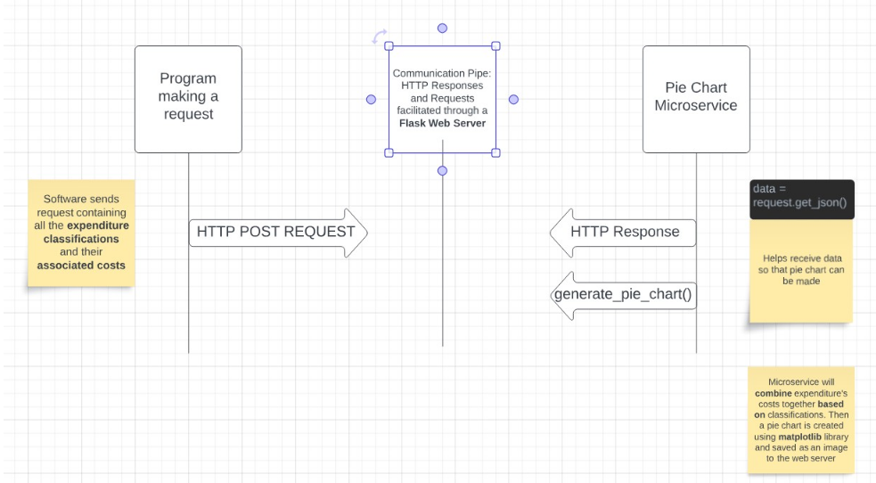

HOW TO REQUEST DATA FROM THE PIE CHART MICROSERVICE:

To request data from the microservice, you can send a HTTP POST request to a URL using "requests.post". The request should be sent to an endpoint named after the function used within the flask script which is generate_pie_chart. So, for example, a sample POST request can look like this: response = requests.post('http://127.0.0.1:8080/generate_pie_chart', json=expenditure_data).
The json variable comes from you preparing the expenditure data in a JSON format. Just create a list of your data and set it to the variable.

HOW TO RECEIVE DATA FROM THE PIE CHART MICROSERVICE

To receive data from the microservice, all you have to do it click on the URL that is hosting the Flask web server while running your software. After the user indicates that they want to create a pie chart of their expenditures, the post request will create a pie chart within the web server and display it to the user.

 
 
